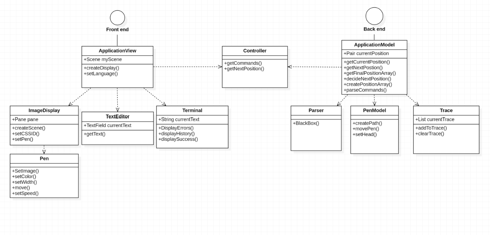
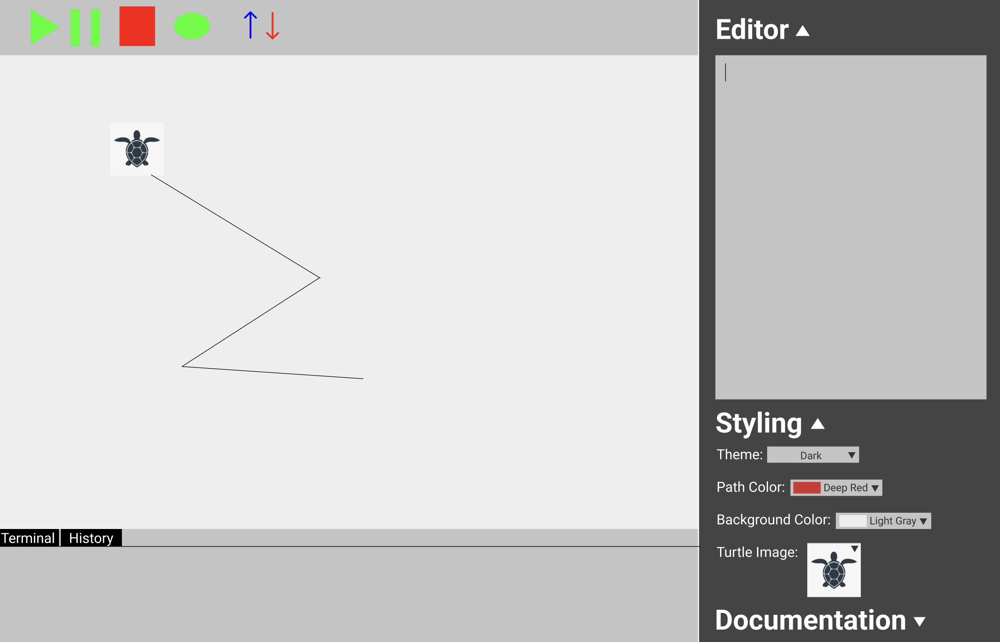

# SLogo Design Plan

### Ritvik Janamsetty, Jose Santillan, Kushagra Ghosh, Robert Cranston

### TEAM 4

## Introduction
The primary goal of this project is to develop a user interface that allows users to develop code that can control the movements of a turtle simulation. It will also allow the user to control the configuration settings of the data.

## Overview

## User Interface

The user interface is quite simple, There will be a bar containing all typical button commands such
as run, pause, stop/terminate, debug features etc. Under it will be display window, where the turtle
will perform actions and draw. The terminal and history will be located below the display. They will
be seperated by tabs where a user can toggle between them. The right-hand side contains the text
editor as well as the styling and turtle selection. The documentation will be located in the bottom
right corner. Error messages will be reported to a user through the terminal panel.

Here is a graphical look at our design:

View the interactable version at
this [Figma Link](https://www.figma.com/file/MVoiL99BXgIIz8qmRXWpj6/Compsci-308-SLOGO).

## Design Details

We will have 4 API's in our project: an external and internal API for the frontend and backend. 
The external API for the frontend will be used to separate the graphical interface from the interpreter
by sending the commands received on screen to the Controller class. We plan to let them communicate when 
necessary through this Controller class, which will send the commands to the external API for the backend.
The external API for the backend also gets and returns the next position publicly to the Controller to then be used
by the frontend. Additionally, the parsing of the commands received by the backend external API will be 
done by the parser classes. We could provide paths for extension through creating subclasses, abstractions,
and interfaces so that each concrete class in the internal backend API would mean a new command or new
features we added so that the External API is not impacted as much. The internal API for the frontend will
deal with implementing the assignment features such as our side bar being toggled, the turtle class and properties
of the turtle (such as setting its color, image, etc.). With each new feature for the frontend we decide, the internal
API will create new subclasses or abstractions in the internal API to communicate with each other and the external
API to display on screen, which allows us to include additional requirements down the line.

## Design Considerations

After experiencing the changes request from the prior assignment, we decided to try to think of as
many ways to change requirement can be added on top of the basic requirements so that we build our
code to be extensible as possible from the start. So when we were thinking of all of our
hierarchies, we decided to make sure that this was the focal point of all discussions. THis led us
to the one main assumption we made during brainstorming: anything that can be in a change request,
will be a change request.

### Parser

By far one of the biggest challenges in completing this project is building the parser. Or initial
idea was to have this in the controller and have the functions passed into the model. However, after
talking with Professor Duvall more about the specifications and best practices, we realized that it
would be best to have centralized all of our parsing logic in the model. That being said, we still
had different ideas on making it work

* **Idea 1:** Parser as a map
    * Pros:
        * Easier to initially implement
    * Cons:
        * Would need a lot of reflective logic to figure out what to do with each command
        * Would lead to a large map initialization and would be difficult to maintain
* **Idea 2 (SELECTED):** Parser as a series of classes with a callback function
    * Pros:
        * Easier to extend
        * More modular and flexible
    * Cons:
        * Requires some understanding to pull off effectively

### Display Window

The display window is the main window where the turtle will perform actions and draw. Our primary
debate around this component is which approach would make it as extensive as possible. This led to
three different ideas that were discussed over the course of our discussions:

* **Idea 1:** A separate window for the display
    * Pros:
        * Could allow for multiple instances of the display window to be run, allowing better
          illustration of random behavior
        * Operated more like other IDEs for other languages
    * Cons:
        * A lot of wasted space in the actual physical layout
        * Not as easy to interact with when trying to debug, considering SLOGO is a visual
          programming language
* **Idea 2:** Window Linked to the Code
    * Pros:
        * Easier to implement
        * Centralizes all the aspects of the IDE into one window
    * Cons:
        * Could not run multiple instances of the display window in any manner: would need to
          restart a window.
* **Idea 3 (SELECTED):** A single window of code with tabs and pagination
    * Pros:
        * Allows for multiple instances of the display window to be run
        * Also allows for multiple code windows to be run concurrently, allowing multiple programs
          to be run at once
    * Cons:
        * You can only have one display active at a given time
        * Hard to implement

## Test Plan

* In order to make our code more easily testable, a strategy we will try to implement is having all methods that would initially be void
return integer values. For example, a successful run of a method will have the method return 0 (kind of like exit code 0 in C). In an unsuccessful method call, 
the method would return -1. This way we can easily test the code by just asserting if the method return is 0.

* Another strategy we will implement into the code in order to test it easier will be to avoid has many Iceberg classes as possible. This is especially true in the action
classes - the ones that perform the action the user inputs. We originally designed these classes so that the "turtle" only needs to call one public method that does all the work about selected the right 
command class, the right command and return the correct values. However, after reading the blog about code designed for testing, have "iceberg" classes is a terrible idea and makes testing harder.

* Parser Test Plan:
  * Test 1:
    * The first test will be a "happy" test in which we feed the parser valid instructions and commands along with the correct syntax
    * The main purpose of this test is to determine if the parser does its job correctly to begin with, obviously the outcome is a successful one (returns 0)
  * Test 2:
    * The second test will be a "sad" test in which we feed the parser all invalid commands with wacky syntax. 
    * The reason for this test is to see how the parser will react to invalid commands and to see if it throws valid error messages and displays them correctly to the user
    * Want the method to return -1 (unsuccessful) OR, simply checking to see if an exception has been thrown
  * Test 3: 
    * The third a final test will be a combination of both, and will have some creative edge cases to test if the parser can is stable and reliable
    * The way we have designed our code to enable parsing testing is to simply have the parser throw errors if it reads unexpected values or invalid syntax. Simply calling the method and checking if it successfully runs
      will be enough to determine whether the parsing works. Also, testing which exception is thrown will help us identify WHERE the issue is.
* Front end testing
  * Test 1: 
    * Test each area of the UI with happy testing. In this test we will have the test perform typical actions a user might due in a certain order. For example, one test case within this category will be
        1. Valid scripting
        2. Changing styling
        3. Checking code history
        4. hitting "run"
        5. hitting "terminate"
  * Test 2:
    * This test will be "sad" testing. Here we will make sure the UI can handle erroneous steps. An example of this is the following
        1. Valid scripting
        2. Hitting terminate without starting anything (just want to make sure this is handled correctly)
        3. Attempting to enter commands while the code is running (unless input is asked for)
        4. trying to change styling mid-code run
  * Test 3: 
    * This test will have creative edge cases, such as attempting to re-run the code while the code is still running, trying to upload a file mid-code run, attempting to save the current state while the 
      code is running, making sure the run button is still accessible after a failed complication, etc.
* Back end testing
    * Test 1:
      * This is the happy test where we will test to see if the turtle returns valid coordinates after successful code is compiled (i.e. the correct coordinates and path are returned to the UI to draw)
      * Obviously we are going to test the coordinates the method returns, or if it's a query, check to see if the correct data has been received by the back-end
    * Test 2: 
      * Test 2 will be the sad testing where we send the back-end runtime errors such as asking a query about a turtle/turtle that doesn't exist (hasn't been instantiated) or 
        a user attempting to perform a division by 0 or something of the sorts 
    * Test 3: 
      * The third test will be edge case testing, pushing the limits of the program. This will include combining a variety of rarely used commands
        attempting to use commands erroneously, etc. This test will require lots of creative thinking
* Controller Testing Plan
  * Test 1:
    * We really only need this one test for the controller and that is by creating a pipeline to the connection between the backend and the frontend and making sure the CORRECT information is being sent to and from.

## Team Responsibilities

* Team Member #1: Jose Santillan Mainly responsible for the UI design and implementation, as well as
  development of the controller that connects the model and the front-end. Furthermore, responsible
  for implementation of JUnit testing

* Team Member #2: Ritvik Janamsetty Mainly responsible for the UI design and implementation, as well
  as development of the controller that connects the model and the front-end. Furthermore,
  responsible for implementation of JUnit testing

* Team Member #3: Kushagra Ghosh Work on the backend logic to control the movements of the turtle
  and work on the parser

* Team Member #4: Robert Cranston Responsible for working on the logic for the turtle and the
  backend.
